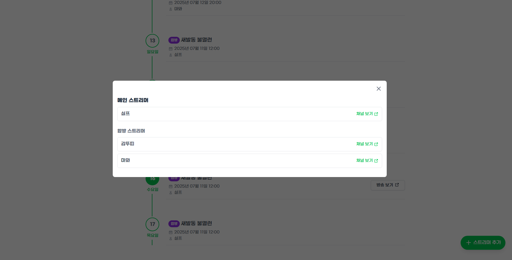

# 🎥 0's Life

> 모두가 함께 만드는 치지직 방송 스케줄 캘린더


---

## 📦 프로젝트 정보

- **프로젝트 주소**
  - 서버 및 배포는 미구현 상태
  - 현재 게획 : AWS, Kubernetes, Docker 학습 후 적용 예정 (변경될 수도 있음)

- **프로젝트 기간**
  - 서비스 개발: 2025.03 \~ 2025.07
  - 서버 구현 및 배포 스터디: 2025.07 \~ 진행 중

- **개발 인원**
  - 1인 개발

---

## 🧭 프로젝트 소개

### 1. 치지직 스트리머 방송 일정 캘린더

치지직 스트리머의 방송 일정을 캘린더와 타임라인 형태로 제공하며, 누구나 방송 일정을 생성하고 수정할 수 있는 오픈 캘린더 서비스입니다.

### 2. 참여형 시스템

스트리머별 채널 페이지를 제공하며, 홈페이지 접속자 누구나 스트리머 방송 일정 추가, 수정이 가능하고 일정 디테일, 공식 방송 여부도 확인할 수 있습니다.

---

## 🛠 기술 스택

#### Frontend

<p align="left">   </p>

#### Backend

<p align="left">   </p>

#### State Management

<p align="left">    </p>

#### API

<p align="left">   </p>

#### Code Quality

<p align="left">   </p>

#### Dev Tools

<p align="left">    </p>

---

## 📁 프로젝트 구조

> 파일은 생략

> 모노레포(Yarn + Workspaces + PnP) 기반 개발

- 공통 모듈은 `shared/` 하위 폴더에 정의
- 앱 단위로는 `apps/front-end`, `apps/back-end` 구성
- 의존성 관리는 Yarn v4 + PnP 기반으로 일원화

```
├── README.md
├── package.json
├── yarn.lock
├── .yarnrc.yml
├── .gitignore
├── .gitattributes
├── apps
│   ├── front-end
│   │   ├── .env
│   │   ├── package.json
│   │   ├── tsconfig.json
│   │   ├── next.config.ts
│   │   ├── tailwind.config.ts
│   │   ├── postcss.config.mjs
│   │   ├── eslint.config.mjs
│   │   ├── public
│   │   │   └── assets
│   │   │       ├── fonts
│   │   │       ├── images
│   │   │       └── svg
│   │   └── src
│   │       ├── api
│   │       ├── app
│   │       │   ├── @modal
│   │       │   │   ├── (.)add
│   │       │   │   ├── (.)channel
│   │       │   │   │   └── [id]
│   │       │   │   ├── (.)detail
│   │       │   │   │   └── [id]
│   │       │   │   ├── [...catchAll]
│   │       │   │   └── default.tsx
│   │       │   ├── add
│   │       │   ├── all
│   │       │   │   ├── calendar
│   │       │   │   └── timeline
│   │       │   ├── channel
│   │       │   │   └── [id]
│   │       │   ├── chzzk
│   │       │   │   ├── calendar
│   │       │   │   └── timeline
│   │       │   ├── detail
│   │       │   │   └── [id]
│   │       │   ├── schedule
│   │       │   │   ├── add
│   │       │   │   └── edit
│   │       │   │       └── [schedule]
│   │       │   ├── streamer
│   │       │   │   └── [id]
│   │       │   │       ├── calendar
│   │       │   │       └── timeline
│   │       │   ├── today
│   │       │   ├── global-error.tsx
│   │       │   ├── globals.css
│   │       │   ├── layout.tsx
│   │       │   └── page.tsx
│   │       └── lib
│   │           ├── components
│   │           │   ├── calendar
│   │           │   ├── common
│   │           │   ├── dropdown
│   │           │   ├── layout
│   │           │   ├── schedule
│   │           │   ├── timeline
│   │           │   └── tiptap
│   │           ├── constants
│   │           ├── fetch
│   │           ├── hook
│   │           ├── providers
│   │           ├── screens
│   │           ├── stores
│   │           ├── types
│   │           └── utils
│
│   └── back-end
│       ├── package.json
│       ├── tsconfig.json
│       ├── nest-cli.json
│       ├── eslint.config.mjs
│       ├── .prettierrc
│       └── src
│           ├── app.controller.ts
│           ├── app.module.ts
│           ├── app.service.ts
│           ├── main.ts
│           ├── lib
│           │   ├── exceptions
│           │   │   └── error
│           │   ├── types
│           │   └── utils
│           ├── schedule
│           │   ├── dto
│           │   │   ├── create-schedule.dto.ts
│           │   │   └── update-schedule.dto.ts
│           │   ├── schedule.controller.ts
│           │   ├── schedule.module.ts
│           │   ├── schedule.service.ts
│           │   └── schedule.validate.ts
│           ├── schemas
│           │   ├── schedule.schema.ts
│           │   └── streamer.schema.ts
│           └── streamer
│               ├── dto
│               │   ├── create-streamer.dto.ts
│               │   └── update-streamer.dto.ts
│               ├── streamer.controller.ts
│               ├── streamer.module.ts
│               ├── streamer.service.ts
│               └── user.validate.ts
│
├── shared
│   ├── constants
│   ├── types
│   └── utils
├── servers
│   └── 미구성
└── node_modules

```

---

## 🎯 주요 화면 및 기능 요약

### \[프론트 주요 기능]

- Fetch API를 기반으로 `baseUrl`, 공통 에러 처리 등을 위한 커스텀 모듈 사용
- Next.js 15의 intercept routing과 parallel routes를 활용한 modal 구조 구현
- 대부분의 API GET 요청은 서버 컴포넌트에서 react-query prefetch로 처리
- 페이지 이동 시 scroll-to-top 처리
- Floating Button은 주요 페이지를 제외하고 항상 표시
- 커스텀 ToastMessage, Modal은 Portal로 구현
- 모달 컨트롤을 위한 이전 URL은 Zustand로 저장
- 이전 URL > 존재 시 push, 없으면 back > 그것도 없으면 fallback으로 push
- 타임라인 모달 닫기 시 이전 스크롤 위치 복원 (session에 저장)

### \[백엔드 주요 기능]

- NestJS에서 custom exception을 통한 예외 처리
- Swagger로 REST API 문서화
- MongoDB 스키마 설계 및 DTO를 통한 타입 검증
- 글로벌 validation pipe를 활용한 유효성 체크
- CORS 정책 설정으로 프론트 요청 허용

### \[메인 화면]

<p align="center">
  
</p>
- Tailwind Keyframe + animation 활용한 비주얼 효과 구성

### \[오늘 화면]

<p align="center">
  
  &nbsp;
  
</p>
- 특정 날짜 기준으로 방송 리스트 렌더링
- 긴 방송 기간 대응을 위한 find 조건:

```ts
$or: [
  { startAt: { $gte: startDate, $lt: endDate } },
  { startAt: { $lt: startDate }, endAt: { $gt: startDate } },
];
```

- 응답은 가공된 Object 형태 (key: 시간, value: 배열)
- 디테일 보기 → 모달 팝업 + 방송국 링크 연결

### \[일정 추가 / 수정 화면]

<p align="center">
  
  &nbsp;
  
  &nbsp;
  
  
</p>

- `react-hook-form`으로 value, validation, error 관리
- "공식 방송" 여부에 따라 입력 제어
- 스트리머 검색형 드롭다운 구현 (없는 이름 제한)
- Tiptap Editor 활용 (텍스트 및 이미지 삽입 가능)
- 수정 시에는 초기값만 세팅하여 동일 기능 유지

### \[캘린더 화면]

<p align="center">
  
  &nbsp;
  
</p>
- `dayjs` + CSS Grid로 달력 뷰 제작
- 월 변경 / 오늘 이동 / 흐림처리 / 일정 colSpan 등 구현
- 일정 4개까지 표시, 나머지는 "더보기" 링크로 처리

### \[타임라인 화면]

<p align="center">
  
  &nbsp;
  
  &nbsp;
  
</p>
- 기본은 오늘 날짜로 스크롤 이동
- 방송 보기 버튼은 오늘 일정만 노출 → 방송국 링크 모달
- 일정 클릭 시 동일하게 디테일 모달 팝업

### \[스트리머 화면]

<p align="center">
  
  &nbsp;
  
</p>
- Floating Button과 모달로 스트리머 추가
- 초성 기준 스트리머 목록 정렬 및 네비게이션 제공
- 클릭 시 해당 스트리머 일정 확인 (캘린더, 타임라인)

### \[공식 방송 화면]

- 공식 일정만 필터링하여 캘린더, 타임라인으로 제공

---

## 🚧 개선 목표

- 서버 구현 및 AWS 기반 배포 설계 필요
- 테스트 모듈 구축 (단위 / 통합)
- 스트리머 등록 정책 결정 필요 (인증자만 등록? 관리자 검수?)
- SEO 최적화를 위한 메타 태그, OG 태그 추가 예정
